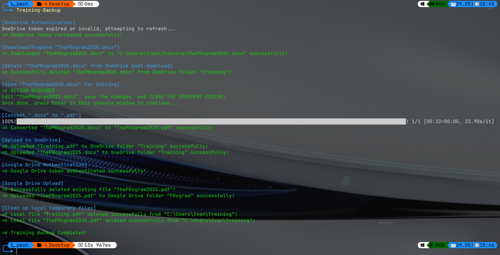

> [!Warning]
> `.gitignore`
> 
> It's highly recommended to add `TrainingBackupCredentials/` to the `.gitignore` file if there is any intention of commiting this repository to a shared/public space. Never commit live tokens or secrets. For this setup, credentials files will be managed locally within this directory.
___
# Preview

___
## Setup Instructions

1.  **Clone Repository**:
    ```bash
    git clone <your_repository_url>
    cd Training_Backup
    ```

2.  **Create Conda Environment**:
    *   Ensure Anaconda or Miniconda is installed.
    *   From the repository root, create and activate the environment:
        ```bash
        conda env create -f TrainingBackup.yml
        conda activate TrainingBackup
        ```

3.  **Configure Cloud Service Credentials**:
    *   Create the `TrainingBackupCredentials` directory in the repository root if it doesn't exist.
    *   **OneDrive**:
        *   Follow the [Azure App Signup step-by-step guide](https://github.com/pranabdas/Access-OneDrive-via-Microsoft-Graph-Python/blob/main/Azure_app_signup_step_by_step.md) to register an application in Azure.
        *   Ensure `Files.ReadWrite.All` (or a more specific `Files.ReadWrite`) and `offline_access` permissions are granted under Microsoft Graph API.
        *   Set the Redirect URI in Azure to `http://localhost:8080/` (type: Web).
        *   Create a client secret.
        *   Create a file named `TrainingBackupCredentials/onedrive_credentials.json` with the following content:
            ```json
            {
                "client_id": "YOUR_AZURE_APP_CLIENT_ID",
                "client_secret": "YOUR_AZURE_APP_CLIENT_SECRET_VALUE"
            }
            ```
    *   **Google Drive**:
        *   Go to the [Google Cloud Console](https://cloud.google.com/).
        *   Create a new project or select an existing one.
        *   Enable the `Google Drive API`.
        *   Go to `OAuth consent screen`. Configure it for `External` users (unless you have a Workspace account and want internal). Add your email as a `Test user` during development.
        *   Go to `Credentials`, click `Create Credentials`, and choose `OAuth client ID`.
        *   Select `Desktop app` as the application type.
        *   Download the JSON credentials file and save it as `TrainingBackupCredentials/google_credentials.json`.

4.  **Configure Local Paths (`configuration.json`)**:
    *   In the root of the repository, create or edit `configuration.json`.
    *   Add an entry for each Windows machine (hostname) you'll run this on. The `hostname` must match the output of `socket.gethostname()` in Python (usually your computer's network name).
        ```json
        {
            "Laptop-Win11": {
                "training_folder": "C:\\Users\\YourUser\\Path\\To\\TrainingFiles",
                "credentials_folder": "C:\\Users\\YourUser\\Path\\To\\Training_Backup\\TrainingBackupCredentials"
            },
            "PC-Win11": {
                "training_folder": "E:\\SomeOtherPath\\Training\\2025",
                "credentials_folder": "E:\\Path\\To\\Training_Backup\\TrainingBackupCredentials"
            },
            "YOUR_HOSTNAME_HERE": {
                "training_folder": "Path\\to\\your\\local\\working\\folder\\for\\ThePRogram2025.docx",
                "credentials_folder": "Path\\to\\your\\Training_Backup\\TrainingBackupCredentials"
            }
        }
        ```
        *   Replace `"YOUR_HOSTNAME_HERE"` with your actual machine's hostname.
        *   Ensure `credentials_folder` points to the `TrainingBackupCredentials` directory within your cloned repository.
        *   `training_folder` is where `ThePRogram2025.docx` will be downloaded to and worked on.

5.  **Configure Batch Script (`TrainingBackup.bat`)**:
    *   Open `TrainingBackup.bat` for editing.
    *   **Python Script Path**:
        *   If your computer's name (`%COMPUTERNAME%`) is `PC-WIN11`, ensure the path `E:\Development\GitHub\Training_Backup\TrainingBackup.py` is correct.
        *   For other computer names, ensure `C:\Users\Ivan\Development\GitHub\Training_Backup\TrainingBackup.py` points to `TrainingBackup.py` in your cloned repository. Adjust this line or add more `else if` conditions if needed:
            ```batch
            if "%COMPUTERNAME%" == "PC-WIN11" (
                set "python_script=E:\Development\GitHub\Training_Backup\TrainingBackup.py"
            ) else (
                set "python_script=C:\Path\To\Your\Clone\Training_Backup\TrainingBackup.py"
            )
            ```
    *   **Conda Activation Path**:
        *   Verify the path to your Miniconda/Anaconda installation and `activate.bat`. The script currently uses:
            ```batch
            call "C:\Users\Ivan\miniconda3\Scripts\activate.bat" "C:\Users\Ivan\miniconda3"
            call conda activate TrainingBackup
            ```
            Adjust `C:\Users\Ivan\miniconda3` if your installation is elsewhere.

6.  **Configure PowerShell Profile (Optional, for `Training-Backup` command)**:
    *   Open your PowerShell profile script. You can find its path by typing `$PROFILE` in PowerShell. If it doesn't exist, create it.
    *   Copy the content of `Training-Backup.ps1` from this repository into your profile script.
    *   Modify the `Set-Location` line within the `Training-Backup` function to point to the root directory of **this cloned repository** (where `TrainingBackup.bat` is located):
        ```powershell
        # Example:
        # $MachineSpecificPaths.TrainingBackupDirectory might be defined elsewhere in a more complex profile.
        # For a simple setup, directly set the path:
        # Set-Location -Path "C:\Path\To\Your\Clone\Training_Backup"
        # Or, if $MachineSpecificPaths is used:
        function Training-Backup {
            $currentDirectory = Get-Location
            # Ensure this path points to the directory containing TrainingBackup.bat
            Set-Location -Path "C:\Path\To\Your\Cloned\Training_Backup_Repository" # <--- MODIFY THIS
            
            try {
                & ".\TrainingBackup.bat"
                Write-Host -ForegroundColor Green "`n=> Training Backup Completed!"
            }
            catch {
                Write-Host -ForegroundColor Red "`n=> Error during Training Backup!"
                Write-Host -ForegroundColor Red $_.Exception.Message
            }
            finally {
                Set-Location -Path $currentDirectory
            }
        }
        ```
    *   Save your PowerShell profile and restart PowerShell or reload the profile (`. $PROFILE`).

7.  **Review Python Script Constants (Optional Customization)**:
    *   The `TrainingBackup.py` script defines several constants at the top that control filenames and cloud folder names:
        ```python
        ONEDRIVE_TARGET_FOLDER = "Training"
        FILE_TO_DOWNLOAD_AND_EDIT = "ThePRogram2025.docx"
        PDF_OUTPUT_FILENAME = "ThePRogram2025.pdf"
        ONEDRIVE_TRAINING_PDF_FILENAME = "Training.pdf" # Last page of PDF_OUTPUT_FILENAME
        GOOGLE_DRIVE_UPLOAD_FOLDER = "PRogram"
        GOOGLE_DRIVE_UPLOAD_FILENAME = "ThePRogram2025.pdf"
        ```
    *   If you need to change these default names/folders, modify them directly in `TrainingBackup.py`.

## Running the Script

1.  Open a new PowerShell terminal (ensure your profile changes are loaded if you modified it).
2.  Type the command:
    ```powershell
    Training-Backup
    ```
3.  **First Run**: You will be prompted to authenticate with OneDrive and Google Drive via your web browser. Follow the on-screen instructions. Access tokens will be stored in the `TrainingBackupCredentials` folder for future runs.
4.  **Manual Editing**: The script will open `ThePRogram2025.docx`. Edit the document, save it, and **close Microsoft Word**.
5.  Press Enter in the console window when prompted to continue the process.
6.  The script will then proceed with PDF conversion and cloud uploads.

Alternatively, you can run the batch script directly if you don't want to use the PowerShell wrapper:
1.  Open Command Prompt or PowerShell.
2.  Navigate to the repository root.
3.  Activate the conda environment: `conda activate TrainingBackup`
4.  Run the batch file: `.\TrainingBackup.bat`

## Python Script (`TrainingBackup.py`) Details

The main Python script orchestrates the entire backup process. Key components include:

*   **Constants**: Defines fixed names for files and cloud folders (see "Setup Instructions" Step 7).
*   **Configuration Loading**: Reads `configuration.json` to determine `training_folder` and `credentials_folder` based on the machine's hostname.
*   **Authentication Functions**:
    *   `authenticate_onedrive()`, `exchange_code_for_tokens()`, `refresh_access_token()`: Manage OneDrive OAuth 2.0 flow.
    *   `authenticate_google_drive()`: Manages Google Drive OAuth 2.0 flow.
*   **OneDrive File Operations**:
    *   `download_file_from_onedrive()`: Downloads `FILE_TO_DOWNLOAD_AND_EDIT` from `ONEDRIVE_TARGET_FOLDER`.
    *   `delete_file_from_onedrive()`: Deletes the specified file from OneDrive.
    *   `upload_to_onedrive()`: Uploads `FILE_TO_DOWNLOAD_AND_EDIT` (the .docx) and `ONEDRIVE_TRAINING_PDF_FILENAME` (single-page PDF) to `ONEDRIVE_TARGET_FOLDER`.
*   **Google Drive File Operations**:
    *   `upload_to_google_drive()`: Uploads `PDF_OUTPUT_FILENAME` to `GOOGLE_DRIVE_UPLOAD_FOLDER`, replacing any existing file.
*   **Local Operations**:
    *   Uses `docx2pdf.convert()` for DOCX to PDF conversion.
    *   Uses `pypdf` to extract the last page for `ONEDRIVE_TRAINING_PDF_FILENAME`.
    *   `os.startfile()`: Opens the DOCX file for editing.
    *   `clean_local_folder()`: Deletes specified local files.

## Error Handling

*   **Authentication Errors**: If tokens are invalid/expired, the script attempts to refresh them. If unsuccessful or on the first run, it initiates a new browser-based authentication flow.
*   **File/Path Errors**: The script checks for the existence of critical files and prints error messages if they are not found. `configuration.json` errors will halt the script.
*   **API Errors**: Catches exceptions during cloud API calls and prints error information.

## Security Considerations

*   **Credential Management**:
    *   API client secrets (`onedrive_credentials.json`, `google_credentials.json`) are stored locally. **Ensure the `TrainingBackupCredentials` folder and its contents are appropriately secured and not committed to public repositories if they contain live secrets.**
    *   OAuth tokens (`*token.json`) are generated and stored locally. These should also be protected.
*   **Token Handling**: The script uses standard OAuth 2.0 libraries for token management, including refresh tokens to minimize re-authentication.
*   **HTTPS Usage**: All API communications with OneDrive and Google Drive are over HTTPS.

## Helpful Sources

These resources were instrumental in developing this script:
*   **Google Drive Backup**: [Automated Google Drive Backups in Python (YouTube)](https://www.youtube.com/watch?v=fkWM7A-MxR0)
*   **OneDrive Backup**: [Access-OneDrive-via-Microsoft-Graph-Python (GitHub)](https://github.com/pranabdas/Access-OneDrive-via-Microsoft-Graph-Python)
